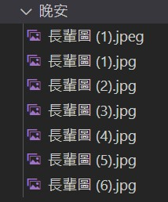

# 長輩圖聊天機器人
這是一個可以煩死你，讓長輩輕鬆傳送長輩圖給各位的聊天機器人
再也不需要浪費手機儲存空間存取一堆圖片啦~
## 指令
* 菜單 

  可以查看所有指令
* 早安 

  傳送一張早安長輩圖
* 午安
  
  傳送一張午安長輩圖
* 晚安

  傳送一張晚安長輩圖
* 地獄

  傳送一張地獄梗

## 實作方法
* 圖片蒐集
  1. 蒐集網路圖片

* 指令fun功能
  1. 早安
  2. 午安
  3. 晚安
  4. 地獄
  
* 產生圖片url

  1. 利用pyimgur 產生圖片的url

      ```
      client_id = '0d519e46f026f35'
      path = '圖片路徑'

      im = pyimgur.Imgur(client_id)
      upload_image = im.upload_image(path)
      return upload_image.link
      ```
  2. 使用隨機變數 隨機傳送圖片

     有幾張圖就random幾個數值去讓它讀取路徑

     

     ```
     r = random.randrange(1, 7)
     path = "晚安/" + "長輩圖 " + "(" + str(r) + ")" + ".jpg"
     ```
* 部屬

  使用Heroku部屬
  
  Line ID:@434nssrs
